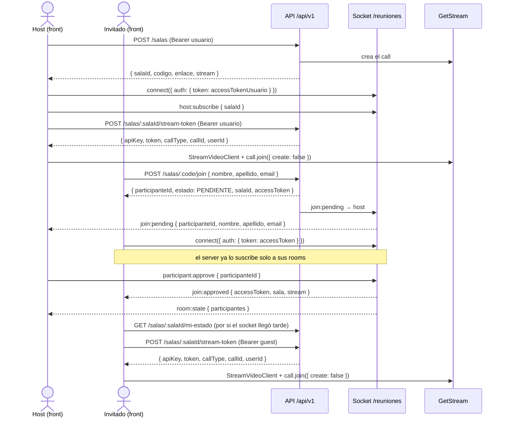
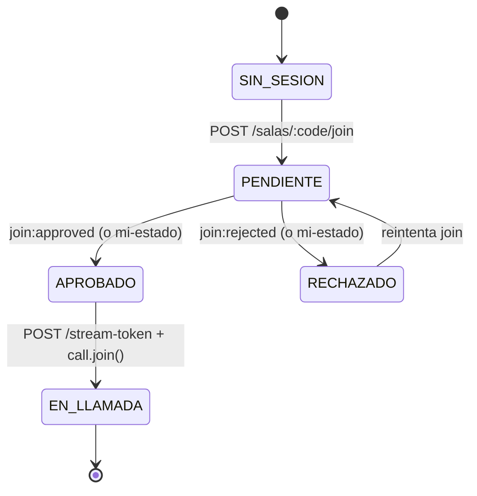

# Guía de integración: sala de espera + GetStream (frontend)

Esta guía es para quien implemente el lado `apps/web` del flujo de ingreso a una
reunión. El contrato completo del backend vive en [`docs/JOIN-FLOW.md`](./JOIN-FLOW.md);
acá está mapeado a los archivos reales del front, con el código sugerido.

---

## 1. La idea en 30 segundos

Pensá la sala como un edificio con portero:

- La **sala de espera** es la recepción: cualquiera puede pararse ahí y pedir pase.
- El **host** es el portero: decide quién entra y quién no.
- El **guest JWT** es la credencial de visitante: te la dan al pedir pase, sirve
  para que el edificio sepa quién sos mientras esperás (y después de que te
  aprueben), pero **no abre la puerta de la sala de reuniones por sí sola**.
- El **stream-token** es la llave de esa sala de reuniones: solo te la dan si tu
  credencial de visitante ya fue aprobada.

Tres credenciales, tres momentos. La sección 2 las detalla.

---

## 2. Las 3 credenciales

| Credencial | Quién la tiene | Cómo se obtiene | Para qué sirve | Dónde guardarla |
|---|---|---|---|---|
| **Access token de usuario** | Host / cualquier usuario logueado | `POST /auth/login` (ya implementado en `lib/auth.tsx`) | Crear salas, `host:subscribe`, aprobar/rechazar, pedir su propio stream-token | `localStorage` (ya lo hace `auth.tsx`) |
| **Guest JWT** | Invitado sin cuenta | Respuesta de `POST /salas/:code/join` — **viene siempre**, incluso en `PENDIENTE` | Autenticar el socket del invitado, `GET /mi-estado`, `POST /stream-token` una vez `APROBADO` | `sessionStorage` (nuevo: `lib/guest-session.ts`) |
| **Stream token** | Host o invitado, ya aprobado | Respuesta de `POST /salas/:salaId/stream-token` | Autenticar el SDK de `@stream-io/video-react-sdk` | En memoria (estado de React), no persistir |

El guest JWT en `PENDIENTE` **no da acceso al video**: `stream-token` exige
`APROBADO` y lo valida el backend contra la base, no confía en nada del cliente.

---

## 3. El flujo completo



### Estados del invitado



`RECHAZADO` puede volver a `PENDIENTE`: nada le impide al invitado reintentar
`POST /salas/:code/join` (el backend no bloquea reintentos tras un rechazo).

### Paso a paso — Host

1. Crear la sala (`POST /salas`, ya implementado). La respuesta trae
   `stream: { callType, callId, callCid }`.
2. Conectar el socket con el access token de usuario y emitir `host:subscribe`
   en **cada** evento `connect` (incluidos los reconnects automáticos de
   socket.io — ver Trampa #1).
3. Escuchar `join:pending`, listar, aprobar/rechazar con
   `participant:approve` / `participant:reject`.
4. Al recargar la página, reconstruir la lista de pendientes con
   `GET /salas/:id/participantes` (ver Trampa #2).
5. Pedir su propio `stream-token` y unirse al call.

### Paso a paso — Invitado

1. `POST /salas/:code/join` con `{ nombre, apellido, email }` — sin auth si es
   anónimo. **Si está logueado, mandá el Bearer y no importa qué pongas en el
   body**: el backend ignora nombre/apellido/email del body y usa los datos de
   la cuenta (evita que alguien logueado impersone otro email).
2. Guardar `accessToken`, `participanteId`, `salaId` en `sessionStorage`.
3. Conectar el socket con `auth: { token: accessToken } }`. El server ya lo
   suscribe a sus rooms — no hace falta `join:subscribe`.
4. Apenas conecta (evento `connect`), consultar `GET /mi-estado`: si el host
   aprobó antes de que el socket terminara de conectar, `join:approved` se
   pierde y `mi-estado` es la única forma de enterarse (Trampa #3).
5. Al recibir `join:approved` (o si `mi-estado` ya dice `APROBADO`): ir a
   `/room`. Si llega `join:rejected`, mostrar el mensaje.
6. En `/room`, leer el guest JWT de `sessionStorage` y pedir el `stream-token`.

---

## 4. Implementación sugerida, archivo por archivo

### 4.1 `app/lib/salas-api.ts`

Hoy `requestSalaJoin` le pega a `/salas/:code/join` (correcto) pero el tipo de
respuesta (`JoinParticipantResponse`) no incluye `accessToken` ni `stream`, y
`generateRoomToken` sigue llamando al alias legacy `/rooms/:id/token` con un
body `{ userId, role, callCid }` que **el backend ignora por completo** (el rol
y el usuario salen siempre de la DB vía `authParticipante`). Reemplazar por
tipos exactos y por el endpoint nuevo:

```ts
// app/lib/salas-api.ts

export type StreamCallRef = {
  callType: string;
  callId: string;
  callCid: string;
};

export type JoinSalaResponse = {
  participanteId: string;
  estado: "PENDIENTE" | "APROBADO" | "RECHAZADO";
  salaId: string;
  /** Guest JWT. Viene también en PENDIENTE. */
  accessToken?: string;
  stream?: StreamCallRef;
};

export type MiEstadoResponse = {
  participanteId: string;
  estado: string;
  rol: "HOST" | "PARTICIPANTE";
  sala: { id: string; codigo: string; nombre: string; estado: string };
  stream: StreamCallRef | null;
};

export type StreamTokenResponse = {
  apiKey: string;
  token: string;
  userId: string;
  user: { id: string; name: string };
  rol: "HOST" | "PARTICIPANTE";
  callType: string;
  callId: string;
  callCid: string;
  sala: { id: string; codigo: string; nombre: string; estado: string };
  expiresAt: string;
};

/**
 * Bearer explícito: para el invitado NO alcanza con `getAccessToken()` de
 * auth.tsx (eso es la sesión de usuario). El invitado usa su guest JWT.
 */
async function requestWithToken<T>(
  path: string,
  token: string | null,
  init?: RequestInit,
): Promise<T> {
  const response = await fetch(`${ROOMS_API_URL}${path}`, {
    ...init,
    headers: {
      "Content-Type": "application/json",
      ...(token ? { Authorization: `Bearer ${token}` } : {}),
      ...init?.headers,
    },
  });
  if (!response.ok) {
    const body = (await response.json().catch(() => null)) as ApiErrorResponse | null;
    throw new Error(body?.error?.message ?? "No se pudo completar la solicitud.");
  }
  return response.json() as Promise<T>;
}

export function joinSala(
  code: string,
  input: { nombre: string; apellido: string; email: string },
): Promise<JoinSalaResponse> {
  // Si hay sesión de usuario, `request()` ya manda el Bearer (ver getAccessToken
  // en el helper existente); el body igual se manda por si el visitante es anónimo.
  return request<JoinSalaResponse>(`/salas/${encodeURIComponent(code)}/join`, {
    method: "POST",
    body: JSON.stringify(input),
  });
}

export function getMiEstado(
  salaId: string,
  token: string | null,
): Promise<MiEstadoResponse> {
  return requestWithToken<MiEstadoResponse>(
    `/salas/${encodeURIComponent(salaId)}/mi-estado`,
    token,
  );
}

export function getStreamToken(
  salaId: string,
  token: string | null,
): Promise<StreamTokenResponse> {
  return requestWithToken<StreamTokenResponse>(
    `/salas/${encodeURIComponent(salaId)}/stream-token`,
    token,
    { method: "POST" },
  );
}
```

Borrar `generateRoomToken` y `RoomTokenResponse` (o dejarlos comentados) una
vez migrados todos los usos a `getStreamToken`.

### 4.2 `app/lib/guest-session.ts` (nuevo)

```ts
// app/lib/guest-session.ts
const KEY = "meetflow.guest";

export type GuestSession = {
  accessToken: string;
  participanteId: string;
  salaId: string;
};

export function saveGuestSession(session: GuestSession) {
  sessionStorage.setItem(KEY, JSON.stringify(session));
}

export function getGuestSession(): GuestSession | null {
  const raw = sessionStorage.getItem(KEY);
  if (!raw) return null;
  try {
    return JSON.parse(raw) as GuestSession;
  } catch {
    return null;
  }
}

/** Actualiza solo el accessToken (join:approved manda uno nuevo, más largo). */
export function updateGuestToken(accessToken: string) {
  const current = getGuestSession();
  if (!current) return;
  saveGuestSession({ ...current, accessToken });
}

export function clearGuestSession() {
  sessionStorage.removeItem(KEY);
}
```

### 4.3 `app/lib/use-guest-waiting.ts` (nuevo hook)

```ts
// app/lib/use-guest-waiting.ts
"use client";
import { useEffect, useRef, useState } from "react";
import { io, type Socket } from "socket.io-client";
import { getRealtimeUrl, getMiEstado, type StreamCallRef } from "./salas-api";
import { getGuestSession, saveGuestSession, updateGuestToken } from "./guest-session";

type Estado = "PENDIENTE" | "APROBADO" | "RECHAZADO";

export function useGuestWaiting(salaId: string | null) {
  const socketRef = useRef<Socket | null>(null);
  const [estado, setEstado] = useState<Estado | null>(null);
  const [stream, setStream] = useState<StreamCallRef | null>(null);

  useEffect(() => {
    const session = getGuestSession();
    if (!salaId || !session || session.salaId !== salaId) return;

    const socket = io(`${getRealtimeUrl()}/reuniones`, {
      transports: ["websocket"],
      auth: { token: session.accessToken },
    });
    socketRef.current = socket;

    socket.on("join:approved", (payload: { accessToken: string; stream: StreamCallRef | null }) => {
      updateGuestToken(payload.accessToken);
      setStream(payload.stream);
      setEstado("APROBADO");
    });

    socket.on("join:rejected", () => setEstado("RECHAZADO"));

    // Trampa #3: si el host aprobó antes de que el socket terminara de
    // conectar, join:approved ya se perdió — mi-estado es la red de seguridad.
    socket.on("connect", async () => {
      try {
        const mine = await getMiEstado(salaId, session.accessToken);
        setEstado(mine.estado as Estado);
        if (mine.stream) setStream(mine.stream);
        if (mine.estado === "APROBADO") {
          // mi-estado no renueva el token; si necesitás uno fresco, volvé a
          // pedir join o usá el que ya tenías guardado (sigue vigente).
        }
      } catch {
        // Sala cancelada/finalizada u otro error: se refleja al pedir stream-token.
      }
    });

    return () => {
      socket.disconnect();
      socketRef.current = null;
    };
  }, [salaId]);

  return { estado, stream };
}
```

### 4.4 `app/lib/host-socket.ts`

Dos cambios necesarios sobre el hook actual:

1. **Re-emitir `host:subscribe` en cada reconexión.** El listener de `connect`
   ya está registrado una sola vez y `socket.io` reconecta solo, así que esto
   **ya funciona** tal como está escrito (`socket.on("connect", …)` corre de
   nuevo en cada reconexión) — no confundir con la Trampa #1, que es sobre la
   *lista de pendientes*, no sobre la suscripción.
2. **Reconstruir la lista de pendientes al montar**, porque `host:subscribe`
   solo suscribe — no devuelve quién ya está esperando:

```ts
// dentro de useHostSocket, después de emitir host:subscribe con éxito:
socket.emit("host:subscribe", { salaId }, async (ack: { ok: boolean }) => {
  if (!ack.ok) return;
  const { participantes } = await getParticipantes(salaId); // ver 4.6 tipos
  setRequests((prev) => {
    const yaEstan = new Set(prev.map((r) => r.participanteId));
    const pendientes = participantes
      .filter((p) => p.estado === "PENDIENTE" && !yaEstan.has(p.id))
      .map((p) => ({
        participanteId: p.id,
        nombre: p.nombre,
        apellido: p.apellido,
        email: p.email,
        timestamp: p.fechaIngreso ?? new Date().toISOString(),
        status: "pending" as const,
      }));
    return [...prev, ...pendientes];
  });
});
```

También conviene manejar el ack de `participant:approve`/`reject` cuando
devuelve `{ ok: false, error: { code: "PARTICIPANT_STATE_CONFLICT" } }`: en ese
caso otro host (u otra pestaña) ya lo resolvió — simplemente sacarlo de la
lista en vez de mostrar error.

### 4.5 `app/(platform)/waiting-room/page.tsx`

Cambios sobre `ParticipantView`:

- Reemplazar el `socket.emit("join:request", …)` directo por
  `joinSala(code, joinForm)` (HTTP), guardar la sesión con
  `saveGuestSession()`, y recién ahí usar `useGuestWaiting(sala.id)` para
  escuchar la resolución. Hoy el socket se conecta **sin `auth`**, así que el
  servidor nunca lo asocia a un participante y `join:approved` no le llega
  nunca — es el BUG-02 ya resuelto del lado backend, pendiente del lado front.
- Si `joinSala` devuelve `estado: "APROBADO"` directamente (reingreso dentro
  de la ventana de 2h), saltar la espera y navegar directo.
- El link a `/room` debe llevar `salaId` (ya lo hace) y ya no necesita armar
  `callId` a mano: `/room` lo va a pedir con `stream-token`.

### 4.6 `app/(platform)/room/page.tsx`

Hoy solo pide `stream-token` (vía el alias legacy `generateRoomToken`) cuando
`user?.id` existe, es decir **nunca para invitados**. Reemplazar por una lógica
que obtenga credenciales de quien esté disponible:

```ts
const guest = getGuestSession();
const credencial = isAuthenticated ? accessToken : guest?.accessToken ?? null;

useEffect(() => {
  if (isDemo || !salaId || !credencial) return;
  let active = true;
  void getStreamToken(salaId, credencial)
    .then((res) => {
      if (!active) return;
      setStreamToken(res.token);
      setApiKey(res.apiKey);
      setCallType(res.callType);
      setCallId(res.callId);
      setDisplayName(res.user.name);
    })
    .catch((error) => {
      if (active) setConnectionError(getErrorMessage(error, "..."));
    });
  return () => { active = false; };
}, [isDemo, salaId, credencial]);
```

Sacar `NEXT_PUBLIC_GETSTREAM_API_KEY` (ya no hace falta: la `apiKey` viene en
la respuesta) y pasarle a `StreamConference` `callType` + `callId` sueltos en
vez de un `callCid` armado a mano.

### 4.7 `app/components/stream-conference.tsx`

Cambiar la prop `callCid: string` (que hoy se parte con `.split(":")`, frágil
si el id tuviera dos puntos) por `callType: string` y `callId: string` directos
desde la respuesta de `stream-token`:

```ts
type StreamConferenceProps = {
  apiKey: string;
  token: string;
  user: { id: string; name: string };
  callType: string;
  callId: string;
};
// ...
const call = nextClient.call(callType, callId);
// ...
await call.join({ create: false }); // ya lo hace — mantenerlo
```

Mantener el `client.disconnectUser()` en el cleanup del `useEffect` — ya está
bien implementado.

### 4.8 `app/sala/[codigo]/page.tsx` (nuevo)

El backend arma el enlace compartido como `${FRONTEND_URL}/sala/${codigo}`
(`rooms.controller.ts`, `createSala`) pero esa ruta no existe en el front — es
el **BUG-01** de `apps/server/docs/bugs.md`. Crear un redirect simple:

```tsx
// app/sala/[codigo]/page.tsx
import { redirect } from "next/navigation";

export default function SalaRedirectPage({ params }: { params: { codigo: string } }) {
  redirect(`/waiting-room?code=${encodeURIComponent(params.codigo)}`);
}
```

### 4.9 `env.example`

```diff
 NEXT_PUBLIC_API_URL=http://localhost:4000/api/v1
 NEXT_PUBLIC_ROOMS_API_URL=http://localhost:4000/api/v1
-NEXT_PUBLIC_GETSTREAM_API_KEY=
```

---

## 5. Manejo de errores

Todos los errores del backend tienen esta forma exacta:

```json
{ "error": { "code": "JOIN_NOT_APPROVED", "message": "Tu ingreso todavía no fue aprobado por el host" } }
```

| Código | Cuándo pasa | Qué mostrar / hacer |
|---|---|---|
| `400 VALIDATION_ERROR` | Falta nombre/apellido/email (invitado anónimo), o email inválido | Marcar los campos del form |
| `401 UNAUTHORIZED` | Token ausente, inválido o vencido | Para invitado: volver a pedir join. Para host: `POST /auth/refresh` o re-login |
| `403 JOIN_NOT_APPROVED` | Pidió `stream-token` estando `PENDIENTE` | Volver a la sala de espera |
| `403 JOIN_REJECTED` | El host rechazó | Mostrar mensaje, ofrecer reintentar el join |
| `403 NOT_A_PARTICIPANT` | El token no corresponde a un participante de esa sala | Tratar como sesión inválida |
| `403 FORBIDDEN` | Guest JWT de otra sala, o `join:subscribe` a un participante ajeno | Error genérico, no debería pasar con uso normal de la UI |
| `403 HOST_ONLY` | `host:subscribe` / approve / reject sin ser HOST | No mostrar el panel de host a quien no lo es |
| `404 ROOM_NOT_FOUND` | Código de sala inexistente | "Esa sala no existe" |
| `409 ROOM_CANCELLED` | La sala fue cancelada | "Esta reunión fue cancelada" |
| `409 ROOM_FINISHED` | La reunión ya terminó | "Esta reunión ya finalizó" |
| `409 ROOM_NOT_SYNCED` | La sala nunca se sincronizó con GetStream (dato viejo/corrupto) | Error genérico, contactar soporte |
| `409 PARTICIPANT_STATE_CONFLICT` | Dos approve/reject casi simultáneos; este ya perdió la carrera | Sacar de la lista de pendientes sin mostrar error |
| `409` (sin code propio, mensaje "sala no sincronizada") | Ídem `ROOM_NOT_SYNCED`, en `stream-token` | Igual que arriba |

Los eventos de socket que fallan emiten además `socket.on("error", ({ code, message }) => ...)`
con la misma forma, además del ack negativo si mandaste callback.

---

## 6. Trampas comunes (de pruebas reales contra el backend)

1. **El reconnect del socket SÍ vuelve a emitir `host:subscribe`** (el listener
   de `connect` corre en cada reconexión), pero **`host:subscribe` nunca
   devuelve la lista de pendientes** — solo suscribe. Si el host recarga la
   página o el socket se cae y reconecta, hay que reconstruir la lista con
   `GET /salas/:id/participantes` filtrando `estado === "PENDIENTE"` (sección 4.4).
2. **La aprobación puede llegar antes de que el socket del invitado termine de
   conectar.** `join:approved` se pierde si nadie está escuchando todavía.
   Por eso `useGuestWaiting` consulta `GET /mi-estado` en el evento `connect`,
   no solo al montar.
3. **El host que abre su propio enlace entra directo como `APROBADO`.** El
   backend reconoce su fila de HOST existente — no hace falta (ni corresponde)
   mostrarle el formulario de join.
4. **Un mismo usuario logueado = un participante por sala.** Si vuelve a hacer
   join, reutiliza su fila existente (por `usuarioId`, no por email) — no se
   crea una segunda fila con estado inconsistente.
5. **Los tres tokens expiran en momentos distintos**:
   - Access token de usuario: `JWT_EXPIRES_IN` (15 min por defecto) → usar
     `POST /auth/refresh`.
   - Guest JWT: `PARTICIPANT_TOKEN_TTL_SECONDS` (2h por defecto) → pasado ese
     plazo, un `APROBADO` vuelve a `PENDIENTE` en el próximo `join`.
   - Stream token: `STREAM_TOKEN_TTL_SECONDS` (1h por defecto) → si el SDK
     reporta error de auth a mitad de la llamada, pedir un `stream-token`
     nuevo con la misma credencial (no hace falta rehacer el join).
6. **`CORS_ORIGIN` en el backend tiene que incluir el origen exacto del
   front** (con protocolo y puerto). Si no está, el fetch falla en el
   navegador con un error de CORS genérico, no con un `403` legible.
7. **`/rooms/:salaId/token` sigue vivo pero es un alias deprecado** de
   `/salas/:salaId/stream-token` — mismo contrato de respuesta, mismo body
   ignorado. Preferir el endpoint nuevo en código nuevo.

---

## 7. Checklist de implementación

- [ ] `salas-api.ts`: agregar `joinSala`, `getMiEstado`, `getStreamToken` tipados; eliminar `generateRoomToken`
- [ ] Crear `lib/guest-session.ts` con los helpers de `sessionStorage`
- [ ] Crear `lib/use-guest-waiting.ts`
- [ ] `waiting-room/page.tsx`: usar `joinSala` + `saveGuestSession` + `useGuestWaiting` en vez de `socket.emit("join:request")` sin auth
- [ ] `host-socket.ts`: reconstruir pendientes con `GET /salas/:id/participantes` tras `host:subscribe`; manejar `PARTICIPANT_STATE_CONFLICT`
- [ ] `room/page.tsx`: pedir `stream-token` para host **y** para invitado (leer credencial según quién esté logueado)
- [ ] `stream-conference.tsx`: recibir `callType`/`callId` sueltos, no `callCid` armado a mano
- [ ] Crear `app/sala/[codigo]/page.tsx` con el redirect a `/waiting-room`
- [ ] Sacar `NEXT_PUBLIC_GETSTREAM_API_KEY` de `env.example` y de todo el código
- [ ] Verificar que `CORS_ORIGIN` del backend incluya el origen del front en todos los entornos

### Cómo probar manualmente (dos ventanas)

1. Ventana 1 (normal): login como host, crear sala, abrir `/waiting-room?code=...&host=true`.
2. Ventana 2 (incógnito): abrir `/waiting-room?code=...`, completar el form, pedir ingreso.
3. En la ventana 1 debería aparecer la solicitud en tiempo real — aprobarla.
4. La ventana 2 debería pasar a "aprobado" sin recargar y poder entrar a `/room`.
5. Recargar la ventana 2 en `/room`: debería recuperar sesión vía `mi-estado`/`sessionStorage` sin volver a pedir permiso.
6. Recargar la ventana 1 (host) durante una espera pendiente: la solicitud debe seguir apareciendo (prueba de la Trampa #1).

---

## 8. Referencia rápida

### Endpoints HTTP

| Método y ruta | Auth | Body | Respuesta |
|---|---|---|---|
| `POST /salas/:code/join` | Opcional (Bearer si está logueado) | `{ nombre, apellido, email }` (ignorado si hay Bearer) | `{ participanteId, estado, salaId, accessToken?, stream? }` |
| `GET /salas/:salaId/mi-estado` | Usuario o guest (acepta `PENDIENTE`) | — | `{ participanteId, estado, rol, sala, stream }` |
| `POST /salas/:salaId/stream-token` | Usuario o guest (exige `APROBADO`) | — | `{ apiKey, token, userId, user, rol, callType, callId, callCid, sala, expiresAt }` |
| `GET /salas/:id/participantes` | Usuario logueado | — | `{ salaId, salaNombre, total, participantes: [...] }` |
| `POST /rooms/:salaId/token` | Igual que `stream-token` | Se ignora | Igual que `stream-token`. **Deprecado.** |

### Eventos de socket (`/reuniones`)

| Evento | Dirección | Payload | Notas |
|---|---|---|---|
| `host:subscribe` | cliente → server | `{ salaId }` | Ack `{ ok: true }`. No devuelve pendientes |
| `join:subscribe` | cliente → server | `{ participanteId }` | Solo si el socket es dueño. No hace falta si ya conectaste con el guest JWT |
| `join:request` | cliente → server | `{ salaCodigo, nombre?, apellido?, email? }` | Alternativa por socket a `POST /join`; se prefiere el HTTP |
| `participant:approve` / `participant:reject` | cliente → server | `{ participanteId }` | Ack puede traer `PARTICIPANT_STATE_CONFLICT` |
| `join:pending` | server → host | `{ participanteId, nombre, apellido, email, timestamp }` | — |
| `join:approved` | server → invitado | `{ participanteId, accessToken, expiresAt, sala, stream }` | — |
| `join:rejected` | server → invitado | `{ sala }` | — |
| `room:state` | server → sala | `{ salaId, estado, participantes }` | Solo aprobados |
| `error` | server → cliente | `{ code, message }` | — |
